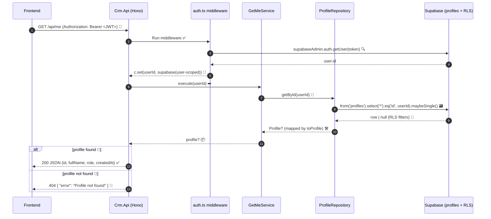

# Profile read flow (`GET /me` example)

End-to-end path from frontend login to JSON response when loading the current user's profile.

## Steps

1. **Frontend** — Sends `Authorization: Bearer <JWT>` on the request (access token from Supabase Auth sign-in).

2. **Api** — Builds a user-scoped Supabase client:
   - `createSupabaseUserClient(SUPABASE_URL, SUPABASE_ANON_KEY, token)`
   - JWT is attached so Postgres RLS runs as that user.

3. **Api** — Creates the repository:
   - `new ProfileRepository(supabase)`

4. **ProfileRepository** — Queries Postgres via PostgREST:
   - `.from('profiles').select('*').eq('id', userId).maybeSingle()`
   - `userId` comes from the verified JWT subject (same as `auth.users.id`).

5. **Postgres RLS** — Filters rows before the result is returned:
   - User can read own row: `id = auth.uid()`
   - Sales and manager can read other profiles (see `002_rls_policies.sql` → `profiles_select`)
   - If not allowed, no row → repository returns `null`.

6. **profileMapper** — Maps the DB row to domain:
   - `toProfile(data)` → `Profile` with `fullName`, `role`, `createdAt`, etc.
   - Only mapped fields matter for the API; extra columns from `select('*')` are ignored.

7. **Api** — HTTP response:
   - `c.json(profile)` (or 404 if `null`)
   - Client receives camelCase JSON aligned with the domain shape, not raw snake_case DB columns.

## 📊 API Response Schema (GET `/api/me`)

### 🧾 Request (Header)

| Field | Value |
|-------|-------|
| `Authorization` | `Bearer <JWT>` 🔐 |

### ✅ 200 Response (Success)

Source: [`users.ts:20-37`](BackEnd/Crm.Api/src/routes/users.ts#L20-L37)

```json
{
  "id": "uuid-string",
  "fullName": "string",
  "role": "client|sales|manager",
  "createdAt": "ISO-8601-string"
}
```

💡 Note: `createdAt` is converted to an ISO string via `toISOString()` when the HTTP JSON is produced. ⏱️

### 🔒 401 Response (Unauthorized)

Source: [`auth.ts:15-40`](BackEnd/Crm.Api/src/middleware/auth.ts#L15-L40)

```json
{
  "error": "Unauthorized"
}
```

### 🚫 404 Response (Not Found)

Source: [`users.ts:27-29`](BackEnd/Crm.Api/src/routes/users.ts#L27-L29)

```json
{
  "error": "Profile not found"
}
```

---

## 🔄 Visual Sequence Diagram (End-to-End)



## Layer responsibilities

| Layer | File / place | Responsibility |
|-------|----------------|----------------|
| Supabase Auth | `auth.users` | Login, issues JWT |
| Api | `Crm.Api` middleware + route | Token extraction, client factory, HTTP status |
| Infrastructure | `ProfileRepository` | DB read |
| Infrastructure | `profileMapper` | Row → `Profile` |
| Domain | `Profile` entity | Type used by rules and services |
| Database | `public.profiles` + RLS | Storage and row-level security |

## Related code

- `BackEnd/Crm.Infrastructure/src/supabase/supabaseUser.ts`
- `BackEnd/Crm.Infrastructure/src/repositories/ProfileRepository.ts`
- `BackEnd/Crm.Infrastructure/src/mappers/profileMapper.ts`
- `BackEnd/Crm.Domain/entities/Profile.ts`
- `supabase/migrations/002_rls_policies.sql` (`profiles_select`)
